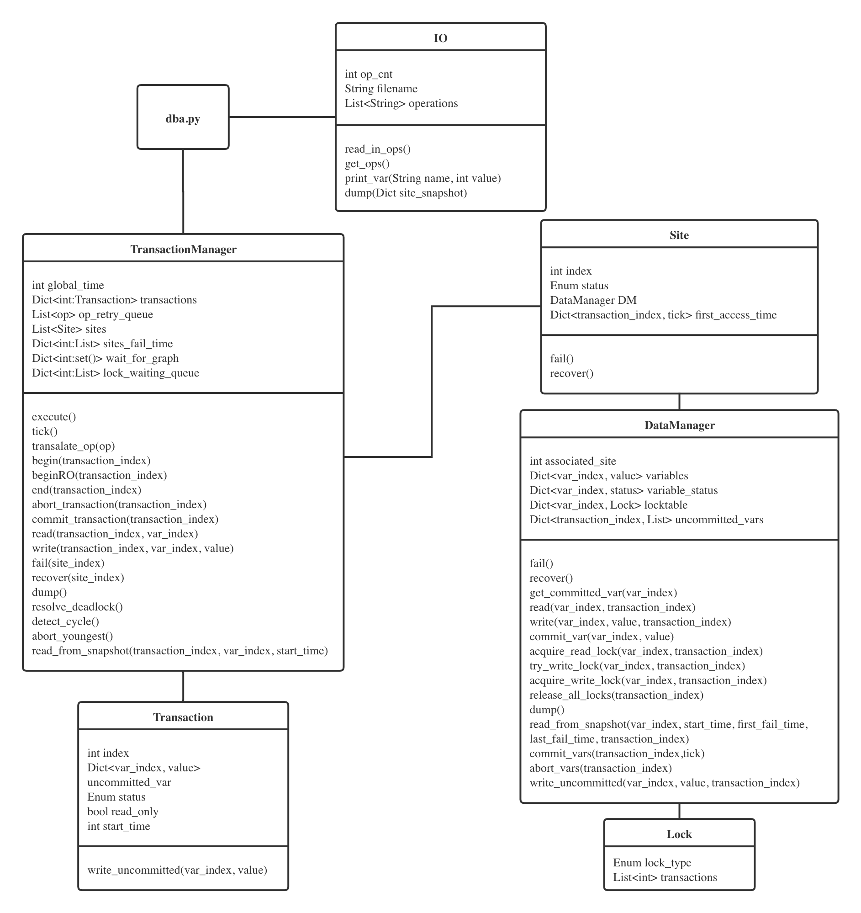

# AdvDB-RepCRec

#### Collaborators: Muxin Xu    Nanxi Cheng


## Run the project

We use Vagrant to make it portable. To run our project, see the following directions.

#### Prerequisites

- Vagrant
- VirtualBox
- Git

#### Test inputs

There are 50 test cases indexed from 1 to 50 under `./data`.

#### Steps to run

Two ways to run:

- Using the `.rpz` file

```bash
vagrant up
vagrant ssh
cd /vagrant

reprounzip directory setup repcrec.rpz repcrec
reprounzip directory run ./repcrec
```

​	This will run the program with `./data/input1`.

- Using the source code

  You can also run directly using our source code with `python3 dba.py <inputfile path>`.

You can check the output in stdout. For more details, please check `log.log` under `/vagrant/repcrec/root/vagrant/AdvDB-RepCRec`.


## Project description

This is the final project for Advanced Database Systems (Fall 2020). In this project, we implemented a simulation of a distributed database system with replicated concurrency control and recovery, using algorithms including available copies algorithm, multi-version read consistency, etc.

#### Design document

Below is a demonstration of the basic structure of our project. 

Two major components of our project are the **Transaction Manager** (**TM** for short), and the **Data Manager** (**DM** for short). The TM manages all the transactions and also functions as a broker who knows the status of all sites, routing requests to them. The DM manipulates data and their status. Each site has its own DM, and lock tables are local to sites.

#### Algorithms

In this project, we are using **available copies algorithm** + **two phase locking** for read-write transactions, and **multi-version read consistency** for read-only transactions. If a deadlock is detected, the youngest transaction in the cycle will be killed to **resolve the deadlock**.




#### Notes on packing the project

```shell
# Packing
git clone https://github.com/MinervaMint/AdvDB-RepCRec.git
cd AdvDB-RepCRec
vagrant up
vagrant ssh
cd /vagrant
# 50 test cases indexed from 1 to 50 under ./data
reprozip trace python ./src/dba.py ./data/input1 
reprozip pack repcrec
```

